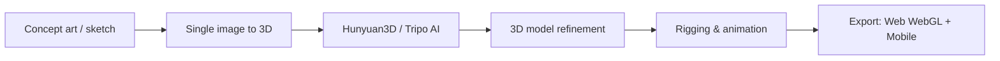
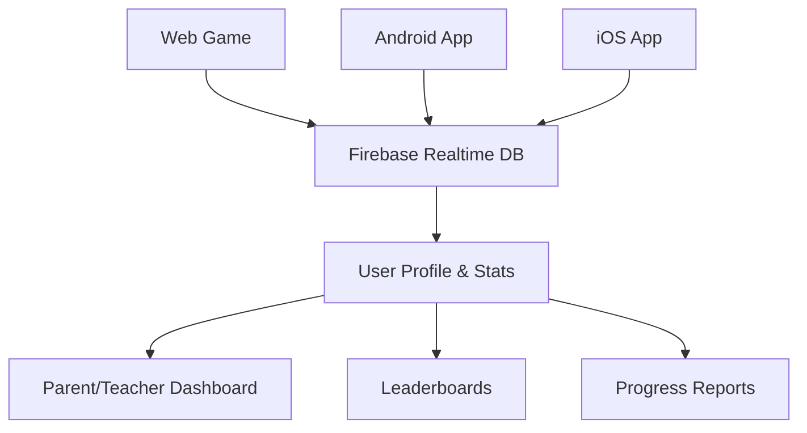
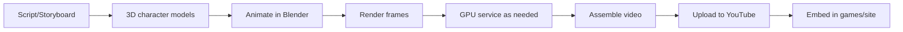

# Educational Game Series

## Purpose
Define the vision, architecture, and development plan for character-based educational games teaching mathematics, languages (English, Spanish), and history with cross-platform stat tracking.

---

## Vision

### Core Concept
**Character-driven learning games** where players progress through educational content disguised as engaging gameplay. Characters maintain persistent stats across web, Android, and iOS platforms.

### Target Audience
- **Primary**: Children ages 6-14
- **Secondary**: Parents and teachers monitoring progress
- **Tertiary**: Lifelong learners of any age

### Educational Domains
1. **Mathematics**: Arithmetic, geometry, algebra, problem-solving
2. **English**: Vocabulary, grammar, reading comprehension
3. **Spanish**: Vocabulary, grammar, conversation
4. **History**: World history, timelines, historical figures

---

## Character System

### Character Design
- **Unique animated characters** for each subject or game series
- **3D models** created using pipeline from `directives/rendering/3d_ai_pipeline.md`
- **Personality traits** that resonate with learning style
- **Visual consistency** across all platforms

### Character Creation Pipeline


**Tools**:
- Initial modeling: Tripo AI, Meshy AI, or Meta SAM 3D (see rendering directive)
- Refinement: Blender (on Oracle or GPU service)
- Animation: Blender + Mixamo (free rigging/animation)

---

## Game Mechanics

### Core Gameplay Loop
1. **Challenge Presentation**: Question or problem in game context
2. **Player Interaction**: Answer via gameplay (not just Q&A)
3. **Immediate Feedback**: Correct/incorrect with explanation
4. **Stat Update**: XP, skills, progress tracked
5. **Reward**: Unlock content, character upgrades, achievements

### Example Games

#### 1. Math Quest
**Genre**: Adventure RPG  
**Mechanic**: Solve math problems to defeat enemies, unlock paths  
**Platform**: Web (HTML5/WebGL), mobile (future)  
**Stats Tracked**:
- Addition/Subtraction level
- Multiplication/Division level
- Problem-solving speed
- Accuracy percentage

#### 2. Word Warriors (English)
**Genre**: Word puzzle + combat  
**Mechanic**: Form words to cast spells, longer words = stronger attacks  
**Platform**: Web, mobile  
**Stats Tracked**:
- Vocabulary size
- Spelling accuracy
- Reading speed  
- Grammar mastery

#### 3. Español Adventure (Spanish)
**Genre**: Interactive story  
**Mechanic**: Choose dialogue options in Spanish, navigate scenarios  
**Platform**: Web, mobile  
**Stats Tracked**:
- Vocabulary (Spanish)
- Conversation skills
- Grammar accuracy
- Cultural knowledge

#### 4. Time Travelers (History)
**Genre**: Interactive timeline + quiz  
**Mechanic**: Travel through history, answer questions to progress  
**Platform**: Web, mobile  
**Stats Tracked**:
- Historical periods mastered
- Event recall accuracy
- Timeline understanding
- Cultural awareness

---

## Stat Tracking System

### Cross-Platform Architecture

**Goal**: User plays on web at school, continues on mobile at home, parents see progress on dashboard



### Backend: Firebase
**Why Firebase**:
- Real-time synchronization across platforms
- Free tier generous for educational use
- Authentication built-in (parent accounts, student profiles)
- Scalable

**Database Structure**:
```json
{
  "users": {
    "user123": {
      "profile": {
        "name": "Student Name",
        "age": 10,
        "parentEmail": "parent@email.com"
      },
      "stats": {
        "math": {
          "level": 5,
          "xp": 1250,
          "skills": {
            "addition": 8,
            "multiplication": 6
          },
          "accuracy": 0.85,
          "gamesPlayed": 42
        },
        "english": { ... },
        "spanish": { ... },
        "history": { ... }
      },
      "achievements": [ ... ],
      "lastPlayed": "2026-01-09T14:00:00Z"
    }
  }
}
```

### Authentication
- **Student Accounts**: Linked to parent/teacher
- **Parent Accounts**: View multiple student profiles
- **Teacher Accounts**: Classroom management (future)
- **Anonymous Play**: Limited features, no stat persistence

---

## Parent/Teacher Dashboard

### Features
- **Progress Overview**: See all subjects at a glance
- **Detailed Reports**: Drill down into specific skills
- **Time Tracking**: How long spent on each game
- **Recommendations**: Suggested focus areas based on performance
- **Export Data**: PDF reports for teachers/schools

### Dashboard Access
- **Web Portal**: dashboard.gabrielnetto.com/education
- **Email Reports**: Weekly summaries via n8n automation
- **Mobile App** (future): Parent app for monitoring

---

## Animation Series Integration

### Concept
Educational animated videos featuring the game characters teaching concepts in entertaining narratives.

### Production Pipeline


**Tool Stack**:
- Scripting: Google Docs / Markdown
- Animation: Blender (Oracle + GPU services)
- Rendering: See `directives/rendering/3d_ai_pipeline.md`
- Post-production: DaVinci Resolve (free) or Blender VSE
- Distribution: YouTube, embedded in games/site

### Episode Format
- **Length**: 5-10 minutes
- **Cadence**: Bi-weekly or monthly
- **Topics**: Align with game curricula
- **Call to Action**: "Play the game to practice!"

---

## Technology Stack

### Web Games
**Framework**: Phaser.js (HTML5 game framework) or Three.js (3D WebGL)  
**Hosting**: Firebase Hosting (free tier)  
**Storage**: Firebase Firestore/Realtime Database  
**Authentication**: Firebase Auth

### Mobile Games (Future)
**Framework**: React Native (share code with web) or Unity (cross-platform)  
**Platforms**: Android (Google Play), iOS (App Store)  
**In-App Purchases**: Optional premium content (ads-free, extra levels)

### Backend
**Primary**: Firebase (Firestore, Auth, Hosting, Functions)  
**Automation**: n8n for analytics, reporting, notifications  
**Analytics**: Firebase Analytics + Google Analytics

---

## Monetization (Optional)

### Free-to-Play Model
- **Core games**: Completely free
- **No ads** in children's area (COPPA compliance)
- **Premium accounts** (future):
  - Ad-free
  - Advanced analytics for parents
  - Early access to new games
  - Exclusive content

### Institutional Licensing (Future)
- **School licenses**: Bulk access for classrooms
- **Teacher tools**: Enhanced dashboards, classroom management
- **Curriculum integration**: Align with educational standards

**Pricing**: TBD, but aim for accessible (<R$20/month per student or site license)

---

## Development Roadmap

### Phase 1: Prototype (Current)
- [ ] Design 1-2 core characters (math, English)
- [ ] Build one web game prototype (Math Quest or Word Warriors)
- [ ] Implement basic stat tracking (Firebase)
- [ ] Test with small user group (friends/family)

### Phase 2: Core Games
- [ ] Develop 4 core games (Math, English, Spanish, History)
- [ ] Full character roster with animations
- [ ] Parent dashboard MVP
- [ ] Cross-platform stat sync (web only initially)

### Phase 3: Mobile Expansion
- [ ] Port to Android
- [ ] Port to iOS
- [ ] Mobile parent app
- [ ] Push notifications for progress updates

### Phase 4: Animation Series
- [ ] Produce first 5 episodes
- [ ] Integrate into games (unlock after completing levels)
- [ ] YouTube channel setup
- [ ] Social media promotion via n8n

### Phase 5: Scaling
- [ ] Teacher dashboard
- [ ] Classroom management features
- [ ] Curriculum alignment (Common Core, BNCC, etc.)
- [ ] Multi-language support (Portuguese, etc.)

---

## Content Creation Workflow

### Game Development
1. **Design**: Concept doc, gameplay mechanics, art style
2. **Assets**: Characters (3D), backgrounds, UI elements
3. **Development**: Code gameplay in Phaser/Unity
4. **Testing**: QA for bugs, educational accuracy, fun factor
5. **Deployment**: Firebase hosting, app stores

### Asset Creation
- **Characters**: See rendering pipeline directive
- **Backgrounds**: AI image generation (Stable Diffusion) + manual touchups
- **UI Elements**: Figma design → export sprites
- **Sound/Music**: Free resources (Freesound, incompetech) or commissioned

### Quality Assurance
- **Educational Accuracy**: Review by educators or subject matter experts
- **Age Appropriateness**: Ensure content fits target age
- **Accessibility**: Subtitles, colorblind modes, difficulty levels
- **Fun Factor**: Playtesting with actual kids

---

## Analytics & Improvement

### Track Key Metrics
- **Engagement**: Time played, retention rate, session frequency
- **Learning Outcomes**: Skill improvement over time, accuracy trends
- **Drop-off Points**: Where do players quit? Is content too hard?
- **Popular Content**: Which games/levels are most engaging?

### Feedback Loops
- **In-game Surveys**: Quick emoji ratings after sessions
- **Parent Feedback**: Dashboard comment feature
- **Teacher Input**: Classroom pilot programs
- **Data-Driven Iteration**: Use analytics to improve games

---

## Legal & Compliance

### COPPA (Children's Online Privacy Protection Act)
- **No personal data** collection without parental consent
- **Parent email verification** for accounts
- **Clear privacy policy** on site
- **No ads** targeted to children

### Educational Standards
- Align content with:
  - Common Core (U.S.)
  - BNCC (Brazil)
  - International standards
- **Certifications** (future): Seek endorsements from educational orgs

### Accessibility (WCAG 2.1 AA)
- **Keyboard controls** for all games
- **Screen reader** support where possible
- **Colorblind modes**
- **Adjustable difficulty**

---

## Collaboration Opportunities

### Solo Development (Current)
You're starting alone, which is fine for MVP/prototype.

### Future Partnerships
- **Educators**: For content validation, curriculum design
- **Animators/Artists**: For scaling character/animation production
- **Voice Actors**: For character voices in animations
- **Developers**: To accelerate mobile porting
- **Schools**: For pilot programs and feedback

**Funding** (if needed):
- Grants for educational tech
- Crowdfunding (Kickstarter/Catarse)
- Angel investors interested in EdTech

---

## Related Directives
- [3D Rendering & AI Pipeline](file:///Users/gabrielnetto/.gemini/antigravity/scratch/gabrielnettocom/directives/rendering/3d_ai_pipeline.md) - Character creation workflow
- [Site Structure](file:///Users/gabrielnetto/.gemini/antigravity/scratch/gabrielnettocom/directives/site/structure.md) - GAMES section implementation
- [Content Sourcing](file:///Users/gabrielnetto/.gemini/antigravity/scratch/gabrielnettocom/directives/content/google_docs_integration.md) - Managing game content (TBD)
