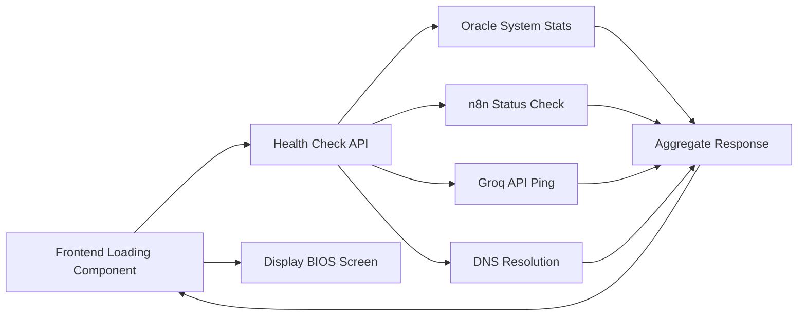

# System Health Monitoring (Real Loading Page)

## Purpose
Transform the fake loading animation into a real system health check that monitors Oracle Cloud server, n8n, AI services, DNS, and other infrastructure components. Display as authentic BIOS-like boot sequence.

> [!IMPORTANT]
> This is a **future enhancement**, not for immediate implementation. Document the concept now, implement later when domain and infrastructure are stable.

---

## Vision

### Current State: Fake Loading
- Boot sequence shows fake progress bars
- Hardcoded "system checks"
- Purely aesthetic, no real monitoring

### Future State: Real Health Dashboard
- **Actual connectivity tests** to services
- **Live resource monitoring** (RAM, disk, CPU on Oracle)
- **Service status** (n8n running? AI terminal accessible?)
- **DNS resolution** check
- **Display as retro BIOS**-style output

---

## Monitored Components

### 1. Oracle Cloud Instance
**What to Check**:
- Server reachable (ping/HTTP status)
- Free RAM available (24GB total)
- Free disk space (200GB total)
- CPU usage/load average
- Uptime

**How to Check**:
```bash
# API endpoint on Oracle instance
GET http://163.176.225.87/api/health

Response:
{
  "status": "online",
  "ram": {
    "total": "24GB",
    "used": "8.5GB",
    "free": "15.5GB"
  },
  "disk": {
    "total": "200GB",
    "used": "45GB",
    "free": "155GB"
  },
  "cpu": {
    "cores": 4,
    "loadAverage": [0.5, 0.7, 0.8]
  },
  "uptime": "15 days"
}
```

**Implementation**:
- Create Express.js or Python Flask API on Oracle
- Use system commands: `free -h`, `df -h`, `uptime`
- Expose on internal endpoint (firewall protected)

---

### 2. n8n Automation Server
**What to Check**:
- n8n accessible at `http://163.176.225.87/n8n`
- Active workflows count
- Recent execution status (success/fail)
- Uptime

**How to Check**:
```bash
GET http://163.176.225.87/n8n/api/v1/workflows
# If returns 200 OK → n8n is running
```

**Implementation**:
- hit n8n API from health check endpoint
- Return simple status: "n8n: OPERATIONAL"

---

### 3. AI Terminal (Groq)
**What to Check**:
- Groq API accessible
- API key valid
- Rate limits remaining (if tracked)
- Last successful request timestamp

**How to Check**:
```javascript
// Ping Groq API
const response = await fetch('https://api.groq.com/health', {
  headers: { 'Authorization': `Bearer ${process.env.GROQ_API_KEY}` }
});
const status = response.ok ? 'OPERATIONAL' : 'OFFLINE';
```

**Implementation**:
- Include in health check API
- Return: "AI Terminal: OK" or "AI Terminal: ERROR"

---

### 4. DNS Status
**What to Check**:
- gabrielnetto.com resolves to correct IP (163.176.225.87)
- DNS propagation complete
- No DNS hijacking detected

**How to Check**:
```bash
# Use DNS lookup API or shell command
dig +short gabrielnetto.com

# Expected: 163.176.225.87
```

**Implementation**:
```javascript
const dns = require('dns').promises;
const dnsStatus = await dns.resolve4('gabrielnetto.com');
if (dnsStatus[0] === '163.176.225.87') {
  return 'DNS: OPERATIONAL';
} else {
  return `DNS: WARNING - Resolves to ${dnsStatus[0]}`;
}
```

---

### 5. Additional Services (Future)
- **ComfyUI**: Check if service is running
- **Blender render queue**: Active jobs count
- **Google Drive sync**: Last sync timestamp
- **Uptime monitor**: Self-reference (is monitoring active?)
- **SSL Certificate**: Expiration date, validity

---

## Display Format

### BIOS-Style Loading Screen

**Visual Reference**: See uploaded image 3 (DOS BIOS configuration screen)

**Display Elements**:
```
╔══════════════════════════════════════════════════════════════════╗
║                        System Boot v1.0.2                       ║
║                     /GABRIELNETTO X (ADMIN)                     ║
╠══════════════════════════════════════════════════════════════════╣
║  Configuration Information                                       ║
║  ┌──────────────────────────────────────────────────────────┐   ║
║  │ BIOS Version: 3.20                                       │   ║
║  │ BIOS Date: 2026-01-09                                    │   ║
║  │                                                           │   ║
║  │ Processor Type: ARM64 Ampere A1                          │   ║
║  │ Math Coprocessor: 4 OCPU                                 │   ║
║  │ Base Memory: 24GB                     Available: 15.5GB  │   ║
║  │ Extended Memory: N/A                                     │   ║
║  │ Video Adapter: Terminal VT323                            │   ║
║  │ Video RAM Size: N/A                                      │   ║
║  │                                                           │   ║
║  │ Hard Drive(s): /dev/sda1 = 200GB      Available: 155GB   │   ║
║  │ Serial Port(s): n8n, groq-ai, dns                        │   ║
║  │ Parallel Port(s): gabriel.netto@gmail.com                │   ║
║  │                                                           │   ║
║  │ Network: gabrielnetto.com → 163.176.225.87 [OK]          │   ║
║  │ n8n Automation: RUNNING                                  │   ║
║  │ AI Terminal: OPERATIONAL                                 │   ║
║  │ DNS Status: PROPAGATED                                   │   ║
║  │                                                           │   ║
║  └──────────────────────────────────────────────────────────┘   ║
║                                                                  ║
║              F2 - Enter Setup    ESC - Boot to Site             ║
╚══════════════════════════════════════════════════════════════════╝

Booting system...
[████████████████████████████████████] 100% COMPLETE

Welcome to gabrielnetto.com! Type 'help' for commands.
$
```

**Implementation**:
- ASCII box drawing characters
- Green phosphor color (#00FF00 on #000000)
- Animated typewriter effect for loading
- Real-time updates from health API

---

## Technical Implementation

### Architecture


### Frontend Component
**File**: `src/components/BootSequence.tsx`

**Enhancement**:
```typescript
const BootSequence = ({ onComplete }) => {
  const [healthData, setHealthData] = useState(null);
  const [loading, setLoading] = useState(true);

  useEffect(() => {
    // Fetch real health data
    fetch('/api/health')
      .then(res => res.json())
      .then(data => {
        setHealthData(data);
        // Simulate boot delay for aesthetic
        setTimeout(() => {
          setLoading(false);
          onComplete();
        }, 3000);
      })
      .catch(err => {
        console.error('Health check failed:', err);
        // Fallback to fake boot sequence
        setTimeout(onComplete, 2000);
      });
  }, []);

  return (
    <div className="bios-screen">
      {healthData ? (
        <>
          <div>Base Memory: {healthData.ram.free} Available</div>
          <div>Hard Drive: {healthData.disk.free} Available</div>
          <div>Network: {healthData.dns.status}</div>
          <div>n8n: {healthData.n8n.status}</div>
          <div>AI Terminal: {healthData.groq.status}</div>
        </>
      ) : (
        <div>Running diagnostics...</div>
      )}
      <ProgressBar progress={loading ? 50 : 100} />
    </div>
  );
};
```

### Backend API Endpoint
**Location**: `execution/monitoring/health_check_api.js` (new file)

```javascript
const express = require('express');
const { exec } = require('child_process');
const dns = require('dns').promises;
const fetch = require('node-fetch');

const app = express();

app.get('/api/health', async (req, res) => {
  try {
    // System stats (Oracle instance)
    const ram = await getRAMStats();
    const disk = await getDiskStats();
    const cpu = await getCPUStats();

    // n8n status
    const n8nStatus = await checkN8N();

    // Groq AI
    const groqStatus = await checkGroq();

    // DNS
    const dnsStatus = await checkDNS();

    res.json({
      status: 'operational',
      timestamp: new Date().toISOString(),
      ram,
      disk,
      cpu,
      n8n: n8nStatus,
      groq: groqStatus,
      dns: dnsStatus
    });
  } catch (error) {
    res.status(500).json({ status: 'error', message: error.message });
  }
});

function getRAMStats() {
  return new Promise((resolve) => {
    exec("free -h | grep Mem | awk '{print $3, $4}'", (err, stdout) => {
      const [used, free] = stdout.trim().split(' ');
      resolve({ total: '24GB', used, free });
    });
  });
}

function getDiskStats() {
  return new Promise((resolve) => {
    exec("df -h / | tail -1 | awk '{print $3, $4}'", (err, stdout) => {
      const [used, free] = stdout.trim().split(' ');
      resolve({ total: '200GB', used, free });
    });
  });
}

async function checkN8N() {
  try {
    const res = await fetch('http://localhost:5678');
    return { status: res.ok ? 'RUNNING' : 'ERROR' };
  } catch {
    return { status: 'OFFLINE' };
  }
}

async function checkGroq() {
  try {
    const res = await fetch('https://api.groq.com/openai/v1/models', {
      headers: { 'Authorization': `Bearer ${process.env.GROQ_API_KEY}` }
    });
    return { status: res.ok ? 'OPERATIONAL' : 'ERROR' };
  } catch {
    return { status: 'OFFLINE' };
  }
}

async function checkDNS() {
  try {
    const ips = await dns.resolve4('gabrielnetto.com');
    if (ips.includes('163.176.225.87')) {
      return { status: 'OPERATIONAL', ip: '163.176.225.87' };
    } else {
      return { status: 'WARNING', ip: ips[0] };
    }
  } catch {
    return { status: 'ERROR' };
  }
}

app.listen(3001, () => console.log('Health API running on :3001'));
```

**Deployment**:
- Run on Oracle instance as systemd service
- Expose via nginx reverse proxy (if needed)
- Protect with IP whitelist or basic auth

---

## Security Considerations

### Sensitive Information
- **Do NOT expose**: API keys, passwords, internal IPs (beyond public IP)
- **Do expose**: General resource usage, service statuses

### Rate Limiting
- Limit health checks to prevent abuse
- Cache results for 30-60 seconds

### Access Control
- Frontend can access `/api/health`
- Consider authentication for admin-only metrics (CPU load, detailed stats)

---

## When to Implement

### Prerequisites
1. ✅ Domain is active and stable  
2. ✅ n8n fully configured and running
3. ✅ Groq AI terminal integrated
4. ✅ All services operational and tested

### Implementation Priority
**Phase**: Post-MVP (after core site is complete)  
**Reason**: Nice-to-have, not critical for initial launch

**Do First**:
- Complete HOME, APPS, GAMES, ARTS, ABOUT, BLOG sections
- Stabilize uptime monitoring
- Ensure all services are reliable

**Then Implement**:
- Create health check API
- Update boot sequence to use real data
- Test and polish BIOS aesthetic

---

## User Experience

### Loading Sequence
1. User visits gabrielnetto.com
2. Real BIOS screen appears with actual system checks
3. Each component checks in ~1-2 seconds
4. Progress bar fills as checks complete
5. "System Ready" message → boot to main site
6. User can press ESC to skip if impatient

### Error Handling
If any check fails:
- Display warning in BIOS screen: "n8n: OFFLINE [WARNING]"
- Still boot to site (don't block user)
- Log error for admin review
- Send notification via uptime monitor

---

## Future Enhancements

### Admin Panel
- Full dashboard with detailed metrics
- Historical graphs (RAM over time, disk usage trends)
- Service restart buttons
- Log viewer

### Public Status Page
- status.gabrielnetto.com
- Shows current status of all services
- Incident history
- Subscribe for updates

---

## Related Directives
- [Uptime Monitor Setup](file:///Users/gabrielnetto/.gemini/antigravity/scratch/gabrielnettocom/directives/monitoring/uptime_monitor_setup.md) - Service monitoring
- [Site Structure](file:///Users/gabrielnetto/.gemini/antigravity/scratch/gabrielnettocom/directives/site/structure.md) - Boot sequence component
- [3D Rendering Pipeline](file:///Users/gabrielnetto/.gemini/antigravity/scratch/gabrielnettocom/directives/rendering/3d_ai_pipeline.md) - Oracle instance configuration
