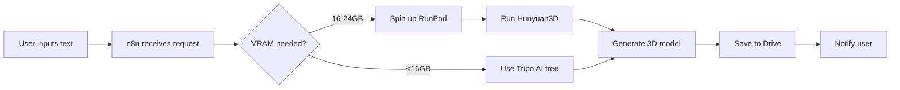
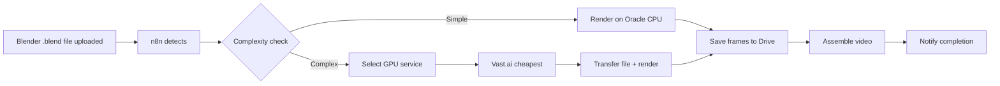

# 3D Rendering & AI Pipeline

## Purpose
Define the architecture for 3D model creation, image generation, and rendering using Oracle Cloud (free tier) as control hub combined with cost-effective GPU services for heavy workloads.

---

## System Overview

### Architecture Goals
1. **Oracle Cloud** (Always Free): Central orchestration, storage, CPU tasks
2. **GPU Services** (On-demand): Rendering, 3D generation, image upscaling
3. **Storage** (Google Drive 2TB): Asset library and output repository
4. **Automation** (n8n): Workflow orchestration and service selection

### Cost Optimization
- Maximize free tier usage (Oracle, Google Colab, Kaggle)
- On-demand GPU only for intensive tasks
- Service selector: Choose cheapest option per VRAM requirement
- Target: R$ 0-5/hour for burst workloads

---

## Oracle Cloud Setup (Hub)

### Instance Specifications
- **Type**: Ampere A1 (Arm architecture)
- **CPU**: 4 OCPU cores
- **RAM**: 24GB  
- **Storage**: 200GB block volume
- **OS**: Ubuntu 22.04 LTS
- **Cost**: R$ 0 (Always Free tier)

### Installed Software

#### 1. n8n (Automation Platform)
**Purpose**: Orchestrate workflows, trigger renders, manage file transfers

**Installation**: Docker-based (already installed)
```yaml
# /Users/gabrielnetto/.gemini/antigravity/scratch/gabrielnettocom/docker-compose.yml
services:
  n8n:
    image: n8nio/n8n
    ports:
      - "5678:5678"
    volumes:
      - n8n_data:/home/node/.n8n
```

**Use Cases**:
- Watch Drive folders for new 3D models
- Trigger rendering on GPU services
- Transfer outputs back to Drive
- Send notifications on completion

#### 2. ComfyUI (Image/AI Workflow Manager)
**Purpose**: Manage AI models, run CPU-based inference, create image workflows

**Installation**: Git clone + Python venv
```bash
git clone https://github.com/comfyanonymous/ComfyUI.git
cd ComfyUI
python3 -m venv venv
source venv/bin/activate
pip install torch torchvision --index-url https://download.pytorch.org/whl/cpu
pip install -r requirements.txt
```

**Limitations on CPU**:
- Slow for diffusion models (minutes to hours per image)
- Use for: Preprocessing, lightweight tasks, testing
- Offload heavy work to GPU services

**Model Storage** (200GB volume):
- Stable Diffusion models (~5GB each)
- Hunyuan3D models (~10-20GB)
- LoRAs and custom models
- Organized in `/mnt/models/`

#### 3. Pinokio (AI App Installer)
**Purpose**: Easy installation and management of AI tools

**Installation**:
```bash
git clone https://github.com/cocktailpeanut/pinokio.git
cd pinokio && ./pinokio.sh
```

**Use for**: Installing additional AI tools without manual dependency management

#### 4. Blender (3D Software)
**Purpose**: 3D modeling, rendering, animation

**Installation**:
```bash
sudo apt install blender -y
```

**Usage**:
- Headless rendering via command line
- Python API for automation
- CPU rendering for simple scenes
- Export to GPU services for complex scenes

**Example Command**:
```bash
blender -b scene.blend -o /output/frame_#### -f 1-100
```

---

## Storage Integration

### Google Drive (2TB Primary Storage)

**Mount on Oracle**:
```bash
# Install rclone
sudo apt install rclone -y

# Configure Drive remote
rclone config

# Mount to /mnt/drive
rclone mount drive: /mnt/drive --daemon --vfs-cache-mode writes
```

**Directory Structure**:
```
/mnt/drive/
├── models/              # 3D models, textures
├── renders/             # Rendered outputs
├── source_images/       # Input images for generation
├── animations/          # Animation files
├── assets/              # Shared assets (characters, props)
└── export/              # Final deliverables
```

**Automation**:
- n8n watches Drive folders for new files
- Auto-sync outputs: `rclone sync /local/renders drive:renders/`
- Cron jobs for scheduled backups

### Alternative: iCloud
**Note**: Less recommended due to API limitations
```bash
# Install icloudpd
pip install icloudpd

# Sync downloads
icloudpd --directory /mnt/icloud --username user@icloud.com
```

---

## GPU Service Integration

### Service Selection Logic

**Goal**: Choose most affordable service based on VRAM requirements

| VRAM Needed | Recommended Service | Est. Cost (BRL/hour) | Use Case |
|---|---|---|---|
| 12-16GB | Vast.ai (V100) | R$ 0.88 | Image upscaling, simple 3D |
| 16-24GB | RunPod (RTX A4000) | R$ 0.93 | Standard 3D rendering |
| 24-40GB | Thunder (A100 40GB) | R$ 3.61 | Complex scenes, animations |
| 40GB+ | RunPod (A100 80GB) | R$ 7.11 | Heavy video rendering |

**Selection Criteria**:
1. Estimate VRAM from task type and model complexity
2. Query available services (API or manual)
3. Choose cheapest with availability
4. n8n workflow handles selection automatically

### 1. Google Colab (Best for Free Testing)

**Free Tier**:
- T4 GPU (~16GB VRAM)
- ~12-24 hours/month allocation
- Session timeouts (12 hours max)

**Paid Tier** (Colab Pro):
- R$ 54.65/month for 100 compute units (~51 hours T4)
- Overage: R$ 1.07/hour (T4), R$ 7.11/hour (A100)

**Integration**:
```python
# Colab notebook connects to Drive
from google.colab import drive
drive.mount('/content/drive')

# Run Blender or ComfyUI in Colab
!apt install blender
!blender -b /content/drive/MyDrive/scene.blend -o output -f 1
```

**Automation**:
- n8n triggers Colab via Google Apps Script webhook
- Output automatically saved to Drive
- Notification on completion

**Best For**: Testing, quick renders, learning

---

### 2. Vast.ai (Peer-to-Peer, Ultra-Cheap)

**Pricing**: Starting R$ 0.88/hour (V100), R$ 2.74/hour (A100)

**Setup**:
1. Create account at vast.ai
2. Browse available instances
3. Rent GPU instance (on-demand or bid)
4. SSH/connect and deploy tools (ComfyUI, Blender)

**Integration with Oracle**:
```bash
# Transfer files via SCP
scp /path/to/model.blend user@vast-instance:/workspace/

# Run render remotely
ssh user@vast-instance 'blender -b /workspace/model.blend -o /output/ -f 1-100'

# Retrieve outputs
scp user@vast-instance:/output/* /mnt/drive/renders/
```

**n8n Workflow**:
- Detect new render job in Drive
- Spin up Vast instance via API (if available)
- Transfer input files
- Execute render command
- Transfer outputs back
- Shutdown instance
- Track costs

**Best For**: Budget-conscious batch rendering

---

### 3. RunPod (Pre-configured AI Templates)

**Pricing**: R$ 0.93/hour (RTX A4000), R$ 1.86/hour (RTX 4090)

**Setup**:
1. Create account at runpod.io
2. Deploy template (ComfyUI, Stable Diffusion, etc.) or custom Docker
3. Access via web UI or API

**ComfyUI Template**:
- One-click deployment
- Pre-installed models
- Access from browser or API
- Persistent storage for models

**Integration**:
```bash
# API to start pod
curl -X POST https://api.runpod.io/v1/pods/start \
  -H "Authorization: Bearer $RUNPOD_API_KEY" \
  -d '{"templateId": "comfyui-template"}'

# Get pod endpoint
POD_URL=$(curl https://api.runpod.io/v1/pods | jq -r '.[0].url')

# Call ComfyUI API for rendering
curl -X POST $POD_URL/prompt -d @workflow.json
```

**n8n Workflow**:
- n8n node for RunPod API
- Start pod on demand
- Upload workflow JSON
- Monitor via webhook
- Download results
- Stop pod

**Best For**: AI image generation, ComfyUI workflows

---

### 4. Kaggle (Free Alternative to Colab)

**Free Tier**:
- 30 hours/week GPU (T4 or P100)
- 20 hours/week TPU
- Notebook-based

**Setup**:
```python
# Kaggle notebook
import os
os.system('pip install some-package')

# Mount input data
!cp ../input/my-dataset/* /kaggle/working/

# Run task
!blender -b scene.blend -o output.png -f 1
```

**Limitations**:
- 12-hour session max
- No persistent storage (use Drive integrations)

**Best For**: Free GPU bursts, experimentation

---

## 3D Model Creation Tools

### Free/Open-Source AI Tools

#### 1. Hunyuan 3D (Tencent)
**Purpose**: Text/image to 3D model generation

**Installation** (on Oracle CPU):
```bash
git clone https://github.com/Tencent-Hunyuan/Hunyuan3D-2.git
cd Hunyuan3D-2
pip install -r requirements.txt

# Download models from Hugging Face
huggingface-cli download tencent/Hunyuan3D-2
```

**Usage**:
```python
# CPU inference (slow)
python generate.py --prompt "a cute robot" --device cpu
```

**For Speed**: Run on GPU service (Vast, RunPod, Colab)

**Best For**: Text-to-3D, image-to-3D generation

---

#### 2. Tripo AI
**Website**: tripo3d.ai  
**Free**: Yes  
**Features**: Single image to 3D model in ~10 seconds  
**Formats**: GLB, FBX, OBJ, USD, STL

**Integration**:
```bash
# Upload via web API or manual
curl -X POST https://api.tripo3d.ai/generate \
  -F "image=@input.jpg" \
  -o model.glb
```

**Best For**: Quick single-image conversions

---

#### 3. Meshy AI
**Website**: meshy.ai  
**Free**: Yes  
**Features**: Image to high-quality 3D model

**Best For**: Quality results from photos

---

#### 4. Meta SAM 3D
**Website**: ai.meta.com/sam3d/  
**Free**: Yes (open-source)  
**Features**: Single photo to 3D model

**Installation**:
```bash
git clone https://github.com/facebookresearch/sam3d.git
cd sam3d
pip install -r requirements.txt
```

**Usage**: Run locally on GPU service or Oracle (CPU mode, slow)

**Best For**: Open-source option with full control

---

#### 5. Trellis, UltraShape, YUME-project, MorphAny3D
**Status**: Research/open-source projects  
**Installation**: Via GitHub, Hugging Face  
**Usage**: Similar to Hunyuan3D (install, download models, run inference)

**Best For**: Experimentation, specific use cases

---

## Image Upscaling Tools

### Free Options

#### 1. Freepik AI Upscaler
**Website**: freepik.com/ai/upscaler  
**Free**: Unlimited upscales to 16x  
**API**: Yes (for automation)

**Integration**:
```bash
# n8n HTTP node
curl -X POST https://api.freepik.com/upscale \
  -F "image=@lowres.jpg" \
  -F "scale=16" \
  -o highres.jpg
```

**Best For**: Batch texture upscaling

---

#### 2. Krea AI
**Website**: krea.ai  
**Free**: Yes, up to 22K resolution  
**Features**: 3D render to photo-like quality

**Best For**: Final polishing of renders

---

#### 3. Topaz Labs (Desktop/Colab)
**Free Tool**: Limited free version  
**Features**: Up to 8x upscale, AI-based

**Best For**: Video frame upscaling

---

## Rendering Workflow Examples

### Workflow 1: Text to 3D Model


### Workflow 2: Image Upscaling for Game Assets


### Workflow 3: Animation Rendering


---

## Cost Tracking

### n8n Cost Monitor Workflow
Track all GPU service usage and costs:

**Inputs**:
- Service name (Vast, RunPod, etc.)
- Instance type (V100, A100, etc.)
- Start/end time
- Cost per hour

**Outputs**:
- Daily/weekly/monthly reports
- Google Sheets log of expenses
- Alerts if budget exceeded
- Optimization suggestions (e.g., "Switch to Kaggle free tier")

---

## Future Enhancements

### LiquidAI Integration
**Status**: Research phase  
**Goal**: Install LiquidAI locally on Oracle for additional inference  
**Consideration**: Free and open-source, but may require GPU for practical use

**Action**: Evaluate when project needs expand

---

### Service Automation Upgrades
- **Auto-bidding** on Vast.ai for lowest prices
- **Multi-service failover** (if one is down, use another)
- **Preemptible instances** for 60-80% cost savings (accept interruptions)

---

## Security Considerations

### Docker/Container Protection
- Run ComfyUI, n8n in isolated Docker containers
- Firewall rules: Only expose necessary ports
- VPN access for remote management
- Regular security updates

### API Key Management
- Store in n8n credentials (encrypted)
- Never commit to Git
- Rotate regularly
- Use environment variables

---

## Related Directives
- [n8n Workflow Management](file:///Users/gabrielnetto/.gemini/antigravity/scratch/gabrielnettocom/directives/n8n/workflow_management.md) - Automation setup
- [System Health Monitoring](file:///Users/gabrielnetto/.gemini/antigravity/scratch/gabrielnettocom/directives/infrastructure/health_monitoring.md) - Monitor Oracle instance (TBD)
- [Educational Game Series](file:///Users/gabrielnetto/.gemini/antigravity/scratch/gabrielnettocom/directives/content/educational_games.md) - 3D character pipeline (TBD)
